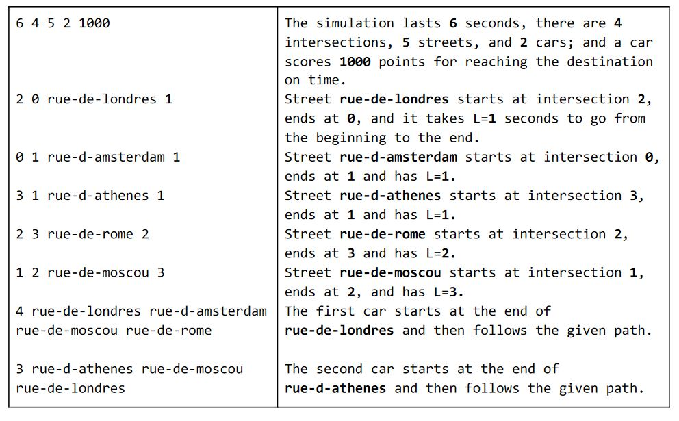
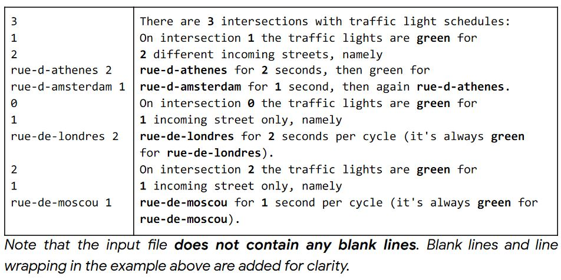

# HashCode 2021 Problem and Solution

## Task

Given the description of a city plan and planned paths for all cars in that city, optimize the schedule of traffic lights to minimize the total amount of time spent in traffic, and help as many cars as possible reach their destination before a given deadine.

---
## Approach

**RoundRobin Algorithm** is used where every traffic light is turned green for **1s**.

---
## Input File Format
Each input dataset is provided in a plain text file. The file contains only ASCII characters with lines ending with a single '\n' character (also called "UNIX-style" line endings). When multiple numbers are given in one line, they are separated by a single space between each two numbers.

- First line contains 5 numbers 
    - an integer D (1 ≤D ≤10^4 ) - the duration of the simulation, in seconds
    - an integer I (2 ≤I ≤10^5 ) - the number of intersections (with IDs from 0 to I-1 )
    - an integer S (2 ≤S ≤10^5 ) - the number of streets,
    - an integer V (1 ≤V ≤10^3 ) - the number of cars
    - an integer F (1 ≤F ≤10 3 ) - the bonus points for each car that reaches

- The next S lines contain descriptions of streets. Each line contains:     
    - two integers B and E (0 ≤ B < I ,0 ≤ E < I )- the intersections at the start and the end of the street, respectively,
    - the street name (a string consisting of between 3 and 30 lower case ASCII characters a-z and the character -)
    - an integer L (1 ≤ L ≤D )- the time it takes a car to get from the beginning to the end of that street.

- The next V lines describe the paths of each car.Each line contains:
    - an integer P (2 ≤ P ≤10^3 )- the number of streets that the car wants to travel, 
    - followed by P names of the streets: The car starts at the end of the first street (i.e. it waits for the green light to move to the next street) and follows the path until the end of the last street. The path of a car is always valid, i.e. the streets will be connected by intersections.

    ### Example
 
    

---
## Submission File Format

The first line must contain a single integer A(0 ≤A ≤ I), the number of intersections for which you specify the schedule. Then, the submission file must describe the intersection schedules, in any order.Each schedule must be described by multiple lines:

- the first line containing a single integer i (0  ≤i  < I ) – the ID of the intersection,
- the second line containing a single integer Ei (0  < Ei ) - the number of incoming streets (of the intersection i) covered by this schedule,
- Ei lines describing the order and duration of green lights. Each of those lines must contain (separated by a single space): 
    - the street name,
    - an integer T  (1  ≤T  ≤D ) – for how long each street will have a green light.


    ## Example

    


## Steps to run the program

To run the program execute the following command:

```
java -cp  .. Y2021.Main [input-file-without-extension [output-file-without-extension]]
```


